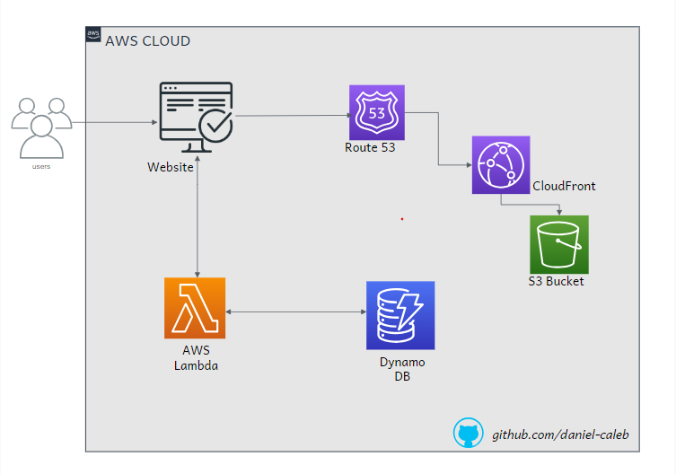

# AWS Cloud Resume Challenge

This is my attempt at cloud resume challenge in AWS.
What is Cloud Resume Challenge? - [The Cloud Resume Challenge](https://cloudresumechallenge.dev/) is a multiple-step resume project which helps build and demonstrate skills fundamental to pursuing a career in Cloud. The project was published by Forrest Brazeal.

## Architecture

(/)

**Services Used**:

- S3
- AWS Lambda
- Dynamo DB
- GitHub Actions
- Terraform

## [Live Demo 🔗](http://resume.daniel.s3-website-us-west-2.amazonaws.com)

## Author

- Twitter: [@marissacaleb0](https://twitter.com/marissacaleb0)
- LinkedIn: [daniel-caleb](https://www.linkedin.com/in/daniel-caleb-cheruiyot/)

## License

This project is under the [MIT](LICENSE) license.
